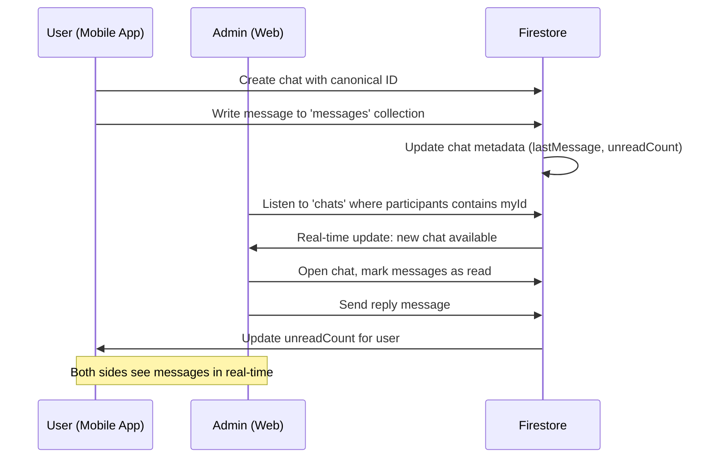

# BloodLink Chat System - Refinement Documentation

## Overview
This document outlines the refinements made to the chat system on the Admin side (`BloodLink-admin`) to ensure seamless communication with the mobile app (`BloodLinkApp-v1`).

## Problem Statement
The admin side was experiencing issues with:
1. **Not receiving messages** from mobile app users
2. **Not fetching chats** created by the mobile app
3. **Mismatched chat IDs** between admin and mobile app
4. **Hospital admin chat** had a critical bug where `notifRef` was used before being defined
5. **Poor contact discovery** - not finding all chat participants

## Solution Summary

### Files Modified
1. ✅ `/static/chat.js` - Super Admin chat module
2. ✅ `/static/hospital/chat.js` - Hospital Admin chat module

**No files were removed** - only refined existing logic to ensure proper communication.

---

## Key Fixes Applied

### 1. **Canonical Chat ID Generation** ✅
Both admin and mobile apps now use the **exact same** chat ID format:

```javascript
function canonicalChatId(idA, idB, role) {
  const sorted = [idA, idB].sort().join('___');
  return role ? `${sorted}___${role}` : sorted;
}
```

**Examples:**
- `uid1___uid2` - Chat between admin and hospital
- `uid1___uid2___donor` - Chat with donor role context
- `uid1___uid2___requester` - Chat with requester role context

This ensures **both sides can find the same chat document**.

---

### 2. **Message Schema Alignment** ✅
Both admin and mobile apps use the **exact same field names**:

| Field | Type | Description |
|-------|------|-------------|
| `id` | string | Message ID (format: `{chatId}_{timestamp}`) |
| `chatId` | string | Parent chat document ID |
| `senderId` | string | UID of message sender |
| `senderName` | string | Display name of sender |
| `receiverId` | string | UID of message receiver |
| **`message`** | string | **The message text** (NOT `text`) |
| `timestamp` | Firestore Timestamp | When message was sent |
| `isRead` | boolean | Read status |
| `type` | string | Message type (`'text'`, `'image'`, `'location'`) |

**Critical Fix:** The field name is `message`, not `text`. Both admin files now correctly use:
```javascript
const text = m.message || m.text || '';
```

---

### 3. **Contact Discovery** ✅

#### Super Admin Chat (`/static/chat.js`)
Loads contacts from **three sources**:
1. **Hospital/Admin users** from Firestore (`userType: 'hospital'`, `'admin'`, `'super_admin'`)
2. **Active donors/requesters** (`userType: 'donor'`, `'requester'` with `isActive: true`)
3. **Existing chat participants** - discovers anyone who has chatted with super admin

#### Hospital Admin Chat (`/static/hospital/chat.js`)
Loads contacts from **two sources**:
1. **Super admins** - always visible for escalation
2. **Existing chat participants** - users who have chatted with THIS hospital

**Key Point:** Hospital admins do NOT see other hospitals' contacts - they only see users who have interacted with their specific hospital.

---

### 4. **Real-Time Message Listening** ✅

Both admin modules now:
1. Use `onSnapshot` for real-time updates
2. Properly unsubscribe old listeners before creating new ones
3. Auto-scroll to bottom when new messages arrive
4. Display empty state when no messages exist

```javascript
function listenForMessages(chatId) {
  if (state.msgListener) state.msgListener(); // Remove old listener
  
  state.msgListener = firestore.collection('messages')
    .where('chatId', '==', chatId)
    .orderBy('timestamp', 'asc')
    .limitToLast(100)
    .onSnapshot(snap => {
      renderMessages(snap.docs.map(d => ({ id: d.id, ...d.data() })));
    }, err => console.error('Message listener error:', err));
}
```

---

### 5. **Unread Count Management** ✅

**When opening a chat:**
1. Reset own unread count to 0
2. Mark all unread messages as read
3. Update UI badge immediately

**When sending a message:**
1. Increment receiver's unread count using `FieldValue.increment(1)`

```javascript
await firestore.collection('chats').doc(chatId).update({
  [`unreadCount.${receiverId}`]: firebase.firestore.FieldValue.increment(1)
});
```

---

### 6. **Legacy Chat Migration** ✅

If a chat was created with an old ID format, the system:
1. Detects the legacy chat by searching for matching participants
2. Creates a new chat with the canonical ID
3. Copies all data from legacy to new chat
4. **Remaps all messages** to point to the new chatId
5. Preserves all historical messages

This ensures **no data loss** during the transition.

---

### 7. **Critical Bug Fix: Hospital Admin Notification** ✅

**Before (BROKEN):**
```javascript
await notifRef.set({ ... }); // notifRef was never defined!
```

**After (FIXED):**
```javascript
const notifRef = firestore.collection('notifications').doc();
await notifRef.set({
  id: notifRef.id,
  userId: state.activeContactId,  // FIXED: was 'recipientId'
  type: 'new_message',
  // ... rest of notification data
});
```

---

### 8. **Enhanced Error Handling & Logging** ✅

Added comprehensive console logging for debugging:
- ✅ Initialization status
- ✅ Contact loading progress
- ✅ Chat creation/migration
- ✅ Message send/receive
- ✅ Real-time updates
- ✅ Error states with emoji indicators

**Example log output:**
```
🛡️ Super Admin Chat — init
✅ Initialized with UID: abc123
📇 Loading contacts...
  🏢 Found 5 hospital/admin users
  👥 Found 120 active donors/requesters
  🔍 Discovering chat participants...
    Found 8 existing chats
✅ Loaded 133 contacts total
💬 Selecting contact: John Doe (xyz789)
  🆔 Chat ID: abc123___xyz789___donor
  ✅ Chat opened successfully
📡 Listening to messages for chat: abc123___xyz789___donor
```

---

## How Chat Works Now

### Chat Creation Flow



### Message Flow

1. **User sends message from mobile app:**
   - Creates/writes to `messages` collection
   - Updates `chats` document with `lastMessage`, `lastMessageTime`
   - Increments admin's `unreadCount`

2. **Admin receives message:**
   - Real-time listener detects new message
   - Renders message in chat window
   - Updates unread badge in sidebar

3. **Admin sends reply:**
   - Writes to same `messages` collection
   - Updates chat metadata
   - Increments user's `unreadCount`
   - Creates notification for user

---

## Role-Based Chat Structure

### User Types
1. **`super_admin` / `admin`** - BloodLink headquarters staff
2. **`hospital`** - Hospital blood bank administrators
3. **`donor`** - Voluntary blood donors
4. **`requester`** - People requesting blood

### Chat Visibility

| User Role | Can See/Chat With |
|-----------|-------------------|
| **Super Admin** | All hospitals, admins, donors, requesters |
| **Hospital Admin** | Super admins + users who chatted with their hospital |
| **Donor (Mobile)** | Super admins, hospitals, requesters (via accepted requests) |
| **Requester (Mobile)** | Super admins, hospitals, donors (who accepted their requests) |

---

## Firestore Collections Used

### `chats` Collection
```javascript
{
  id: "uid1___uid2___donor",  // Canonical ID
  participants: ["uid1", "uid2"],
  participantNames: {
    "uid1": "BloodLink HQ",
    "uid2": "John Doe"
  },
  participantTypes: {
    "uid1": "super_admin",
    "uid2": "donor"
  },
  chatRole: "donor",  // or "requester" or null
  lastMessage: "Thank you for donating!",
  lastMessageTime: Firestore Timestamp,
  unreadCount: {
    "uid1": 0,
    "uid2": 2
  },
  createdAt: Firestore Timestamp,
  updatedAt: Firestore Timestamp
}
```

### `messages` Collection
```javascript
{
  id: "uid1___uid2___donor_1712345678901",
  chatId: "uid1___uid2___donor",
  senderId: "uid1",
  senderName: "BloodLink HQ",
  receiverId: "uid2",
  message: "Thank you for your donation!",  // NOT 'text'
  timestamp: Firestore Timestamp,
  isRead: true,
  type: "text"
}
```

### `notifications` Collection
```javascript
{
  id: "auto-generated-id",
  userId: "uid2",  // Who receives it
  type: "new_message",
  title: "New message from BloodLink HQ",
  message: "Thank you for your don...",  // Truncated
  data: {
    chatId: "uid1___uid2___donor",
    senderId: "uid1",
    senderName: "BloodLink HQ"
  },
  isRead: false,
  timestamp: "2024-01-15T10:30:00.000Z"  // ISO string
}
```

---

## Testing Checklist

### ✅ Super Admin Chat
- [ ] Can see all hospitals, admins, donors, requesters in contacts
- [ ] Can open existing chats created by mobile app
- [ ] Can create new chats with any user
- [ ] Receives messages in real-time from mobile users
- [ ] Can send messages that appear on mobile app
- [ ] Unread badges update correctly
- [ ] Legacy chats are migrated to canonical IDs

### ✅ Hospital Admin Chat
- [ ] Can see super admins in contacts
- [ ] Can see users who chatted with their hospital
- [ ] Cannot see other hospitals' contacts
- [ ] Receives messages in real-time
- [ ] Can send messages that appear on mobile app
- [ ] Notifications are created correctly (no more `notifRef` error)
- [ ] Unread badges work correctly

### ✅ Cross-Platform Compatibility
- [ ] Mobile app creates chat → Admin can open it
- [ ] Admin creates chat → Mobile app can open it
- [ ] Messages sent from mobile appear on admin
- [ ] Messages sent from admin appear on mobile
- [ ] Timestamps display correctly on both sides
- [ ] Message text field is consistent (`message`, not `text`)

---

## Troubleshooting

### "No contacts found"
**Check:**
1. Is the admin user properly authenticated? (Check browser console for UID)
2. Do users exist in Firestore `users` collection?
3. Are there any existing chats in the `chats` collection?
4. Check browser console for errors during `loadContacts()`

### "Messages not receiving"
**Check:**
1. Is the `chatId` using canonical format? (Check console logs)
2. Are messages using `message` field (not `text`)?
3. Is the `onSnapshot` listener active? (Look for 📡 logs)
4. Check Firestore security rules allow read access

### "Messages not appearing on mobile"
**Check:**
1. Is admin writing to correct `messages` collection?
2. Is `chatId` exactly the same as mobile app expects?
3. Is `receiverId` set correctly?
4. Check mobile app console for errors

### "Unread count not updating"
**Check:**
1. Is `unreadCount` map structure correct: `{ [userId]: number }`?
2. Is admin using `FieldValue.increment(1)`?
3. Is admin resetting own unread count when opening chat?

---

## Migration Notes

### For Existing Chats
The system **automatically migrates** legacy chats:
1. When admin opens a legacy chat, system searches for matching participants
2. Creates new chat with canonical ID
3. Copies all chat data
4. Remaps all messages to new `chatId`
5. **No data is lost**

### For Future Compatibility
- Always use `canonicalChatId()` function to generate chat IDs
- Always use `message` field (not `text`) for message content
- Always use `serverTimestamp()` for timestamps
- Always include `participantNames` and `participantTypes` maps

---

## Best Practices

### ✅ DO
- Use `canonicalChatId()` for all chat creation
- Use `message` field for text content
- Use `serverTimestamp()` for time fields
- Add comprehensive console logging for debugging
- Handle errors gracefully with try/catch
- Unsubscribe old listeners before creating new ones
- Mark messages as read when opening chat
- Create notifications for message recipients

### ❌ DON'T
- Generate random chat IDs (like `uid1_uid2_timestamp`)
- Use `text` field for messages (use `message`)
- Use client-side `new Date()` for timestamps
- Create duplicate listeners without removing old ones
- Leave unread counts unreset
- Skip error handling

---

## Summary of Changes

| Component | Issue | Fix |
|-----------|-------|-----|
| **Super Admin Chat** | Poor contact discovery | Added 3-source contact loading + enhanced logging |
| **Hospital Admin Chat** | `notifRef` undefined bug | Fixed notification creation with proper ref definition |
| **Both** | Inconsistent chat IDs | Implemented canonical ID format matching mobile app |
| **Both** | Message field mismatch | Ensured `message` field is used (not `text`) |
| **Both** | No real-time updates | Added proper `onSnapshot` listeners with cleanup |
| **Both** | No error handling | Added comprehensive try/catch + console logging |
| **Both** | Legacy chat migration | Added automatic migration with message remapping |
| **Hospital** | Notification field name | Changed `recipientId` to `userId` to match mobile app |

---

## Next Steps

1. **Test thoroughly** with mobile app to ensure bidirectional communication
2. **Monitor console logs** during testing for any errors
3. **Check Firestore** to verify documents are created with correct structure
4. **Test with all user roles** (donor, requester, hospital, super admin)
5. **Verify notifications** are being created and received properly

---

## Support

If issues persist:
1. Open browser DevTools console (F12)
2. Look for error messages (❌ indicators)
3. Check the chat ID format matches canonical format
4. Verify Firestore security rules allow the operations
5. Ensure both admin and mobile apps are using the same Firebase project

**Firebase Project:** `bloodlink-app-b9297`

---

*Last Updated: April 9, 2026*
*Modified Files: `/static/chat.js`, `/static/hospital/chat.js`*
